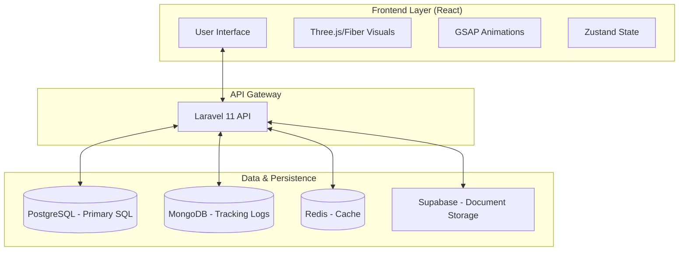
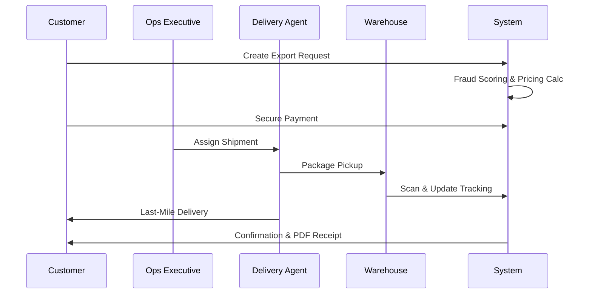

# 📦 DakExport — Logistics & Export Management System

[](https://github.com/ragnarStark79/DakExport/actions/workflows/backend-ci.yml)
[](https://laravel.com)
[](https://reactjs.org)
[](https://threejs.org)
[](https://tailwindcss.com)

**DakExport** is a premium, full-stack logistics platform designed to manage the entire export lifecycle. From real-time shipment tracking with 3D visualizations to automated fraud detection and agent management, it provides a state-of-the-art interface for customers, agents, and administrators.

---

## 🛠 Tech Stack

### Backend (Laravel Subsystem)
- **Core**: Laravel 11 (PHP 8.2+)
- **Database**: 
  - **Relational**: PostgreSQL (Production) / SQLite (Development)
  - **Document**: MongoDB Atlas (Scalable logs & tracking data)
- **Cache**: Redis for high-speed session and data caching
- **Storage**: S3-compatible storage via Supabase
- **Security**: Sanctum SPA Authentication + 2FA support

### Frontend (React Subsystem)
- **Core**: React 19 + Vite 8
- **Visuals**: Three.js (React Three Fiber/Drei) for 3D globe and shipment effects
- **Animations**: GSAP for premium micro-interactions
- **Styling**: Tailwind CSS 4 (Next-gen CSS performance)
- **State**: Zustand for lightweight, scalable state management

---

## 🏗 System Architecture



---

## 🔄 Core Workflow: Export Lifecycle



---

## 🚀 Getting Started

### Prerequisites
- PHP 8.2+
- Node.js 20+
- Composer
- PostgreSQL (or use SQLite for dev)

### Installation

1. **Clone the repository**
   ```bash
   git clone git@github.com:ragnarStark79/DakExport.git
   cd DakExport
   ```

2. **Setup Backend**
   ```bash
   cd backend
   composer install
   cp .env.example .env
   php artisan key:generate
   php artisan migrate --seed
   php artisan serve
   ```

3. **Setup Frontend**
   ```bash
   cd ../frontend
   npm install
   npm run dev
   ```

---

## 📂 Project Structure

```text
DakExport/
├── backend/            # Laravel 11 API Subsystem
│   ├── app/            # Core Business Logic (Services, Repositories)
│   ├── database/       # Migrations & Seeders
│   └── routes/         # API Versioned Routes (V1)
├── frontend/           # React 19 + Vite Subsystem
│   ├── src/
│   │   ├── components/ # Modular UI (Admin, Agent, Customer)
│   │   ├── pages/      # Feature-specific views
│   │   └── lib/        # API Clients & Utilities
├── docs/               # Technical Documentation
└── docker-compose.yml  # Orchestration for Production
```

---

## 🛠 Help & Maintenance Commands

### Backend Maintenance
| Command | Description |
| :--- | :--- |
| `php artisan list` | List all available artisan commands |
| `php artisan migrate:fresh --seed` | Wipe DB and re-seed with dummy data |
| `php artisan tinker` | Interactive REPL for testing code |
| `php artisan route:list` | View all registered API routes |

### Frontend Maintenance
| Command | Description |
| :--- | :--- |
| `npm run dev` | Start Vite development server |
| `npm run build` | Generate production build in `dist/` |
| `npm run lint` | Run ESLint check |

---

## 🔐 Role-Based Access Control (RBAC)
The system supports multiple distinct roles, each with a specialized dashboard:
- **Admin**: System configuration, user management, and fraud analytics.
- **Customer**: Shipment creation, tracking, and document management.
- **Delivery Agent**: Assignment management, shift tracking, and location pinging.
- **Ops Executive**: Shipment validation and agent allocation.
- **Warehouse Manager**: Real-time package scanning and status updates.

---

## 📄 License
This project is licensed under the MIT License - see the [LICENSE](LICENSE) file for details.
